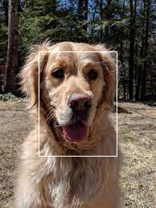
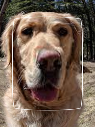
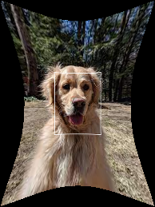
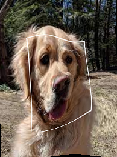

# tps

[](https://github.com/raphaelreme/tps/actions/workflows/tests.yml)


Implementation of Thin Plate Spline.
(For a faster implementation in torch, look at [torch-tps](https://github.com/raphaelreme/torch-tps))


## Install

### Pip

```bash
$ pip install thin-plate-spline
```

### Conda

Not yet available


## Getting started

```python

import numpy 
from tps import ThinPlateSpline

# Some data
X_c = np.random.normal(0, 1, (800, 3))
X_t = np.random.normal(0, 2, (800, 2))
X = np.random.normal(0, 1, (300, 3))

# Create the tps object
tps = ThinPlateSpline(alpha=0.0)  # 0 Regularization

# Fit the control and target points
tps.fit(X_c, X_t)

# Transform new points
Y = tps.transform(X)
```

## Examples

We provide different examples in the `example` folder. (From interpolation, to multidimensional cases and image warping).


### Image warping

The elastic deformation of TPS can be used for image warping. Here is an example of tps to increase/decrease the size of the center of the image or using random control points:



Have a look at `example/image_warping.py`.


## Build and Deploy

```bash
$ python -m build
$ python -m twine upload dist/*
```
